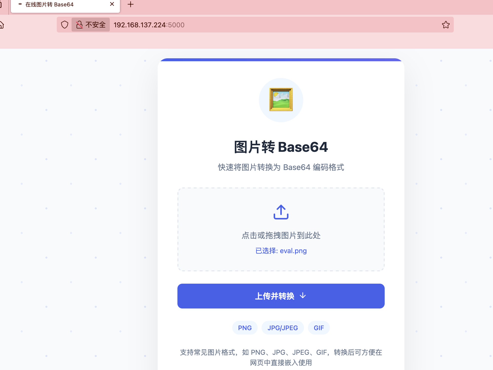
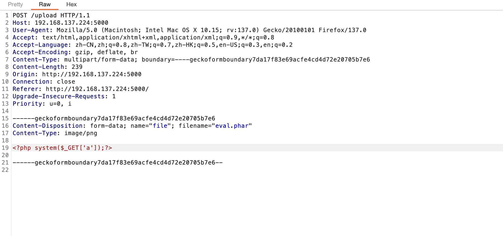
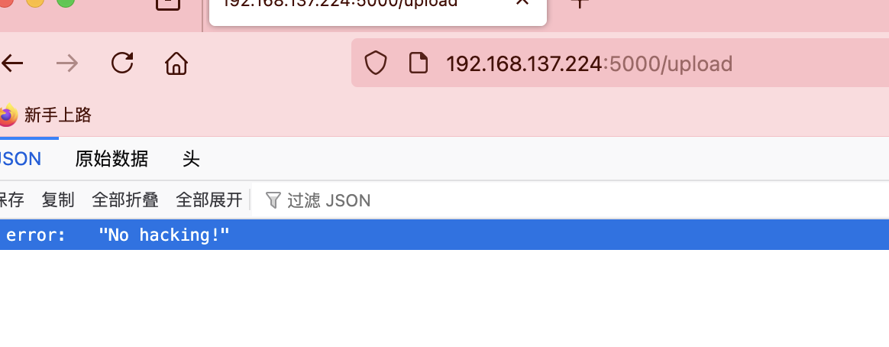
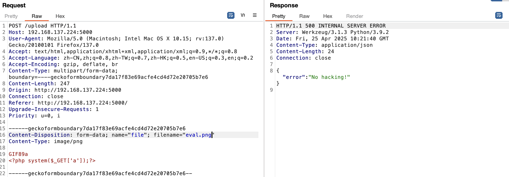
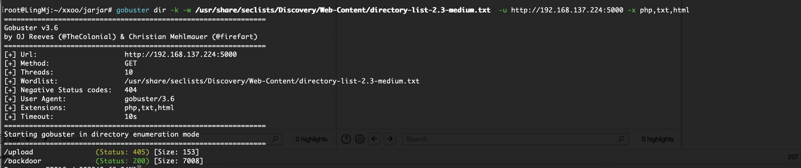
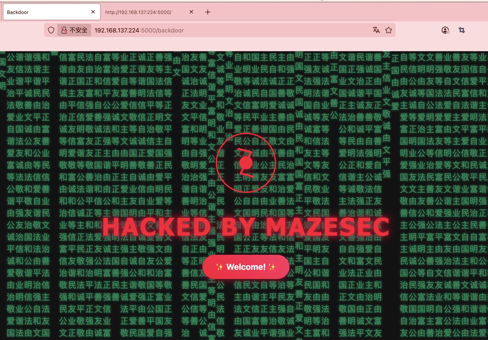
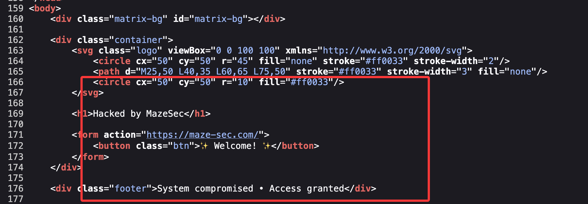
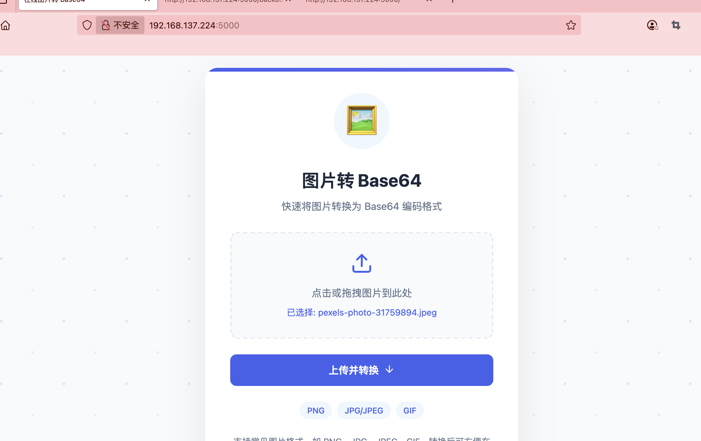
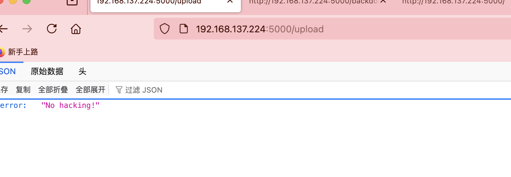

## 网段扫描
```
root@LingMj:~/xxoo/jarjar# arp-scan -l
Interface: eth0, type: EN10MB, MAC: 00:0c:29:d1:27:55, IPv4: 192.168.137.190
Starting arp-scan 1.10.0 with 256 hosts (https://github.com/royhills/arp-scan)
192.168.137.1	3e:21:9c:12:bd:a3	(Unknown: locally administered)
192.168.137.55	62:2f:e8:e4:77:5d	(Unknown: locally administered)
192.168.137.135	a0:78:17:62:e5:0a	Apple, Inc.
192.168.137.224	3e:21:9c:12:bd:a3	(Unknown: locally administered)

7 packets received by filter, 0 packets dropped by kernel
Ending arp-scan 1.10.0: 256 hosts scanned in 2.130 seconds (120.19 hosts/sec). 4 responded
```

## 端口扫描

```
root@LingMj:~/xxoo/jarjar# nmap -p- -sV -sC 192.168.137.224 
Starting Nmap 7.95 ( https://nmap.org ) at 2025-04-25 06:09 EDT
Nmap scan report for ta0.mshome.net (192.168.137.224)
Host is up (0.0096s latency).
Not shown: 65533 closed tcp ports (reset)
PORT     STATE SERVICE VERSION
22/tcp   open  ssh     OpenSSH 8.4p1 Debian 5+deb11u3 (protocol 2.0)
| ssh-hostkey: 
|   3072 f6:a3:b6:78:c4:62:af:44:bb:1a:a0:0c:08:6b:98:f7 (RSA)
|   256 bb:e8:a2:31:d4:05:a9:c9:31:ff:62:f6:32:84:21:9d (ECDSA)
|_  256 3b:ae:34:64:4f:a5:75:b9:4a:b9:81:f9:89:76:99:eb (ED25519)
5000/tcp open  http    Werkzeug httpd 3.1.3 (Python 3.9.2)
|_http-title: \xE5\x9C\xA8\xE7\xBA\xBF\xE5\x9B\xBE\xE7\x89\x87\xE8\xBD\xAC Base64
|_http-server-header: Werkzeug/3.1.3 Python/3.9.2
MAC Address: 3E:21:9C:12:BD:A3 (Unknown)
Service Info: OS: Linux; CPE: cpe:/o:linux:linux_kernel

Service detection performed. Please report any incorrect results at https://nmap.org/submit/ .
Nmap done: 1 IP address (1 host up) scanned in 30.41 seconds
```

## 获取webshell
  

>文件上传转换么
>

  
  
  

>哈？这样也不行要base64转么
>

  
  

>这个页面没东西
>

  

>单纯宣传么，哈哈哈
>

  
  

>传啥都no hack啥玩意感觉要做不出啦
>


## 提权

>哈哈哈哈哈
>


>userflag:
>
>rootflag:
>