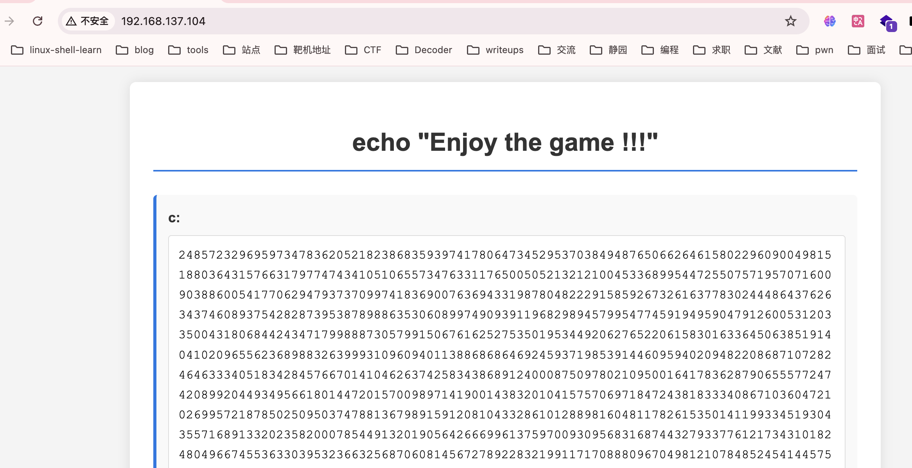
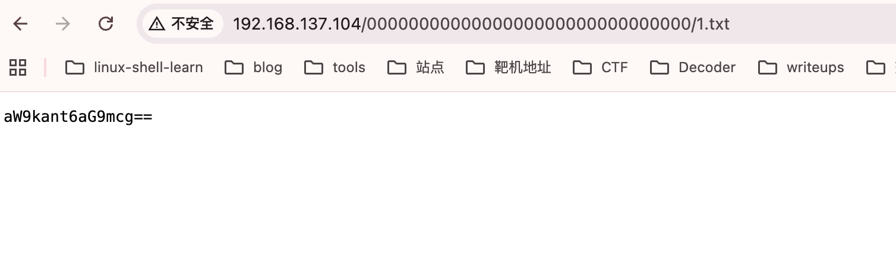
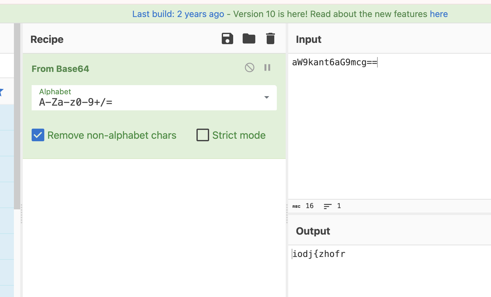
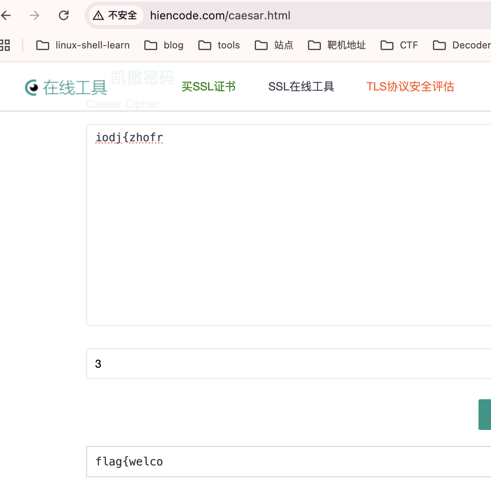
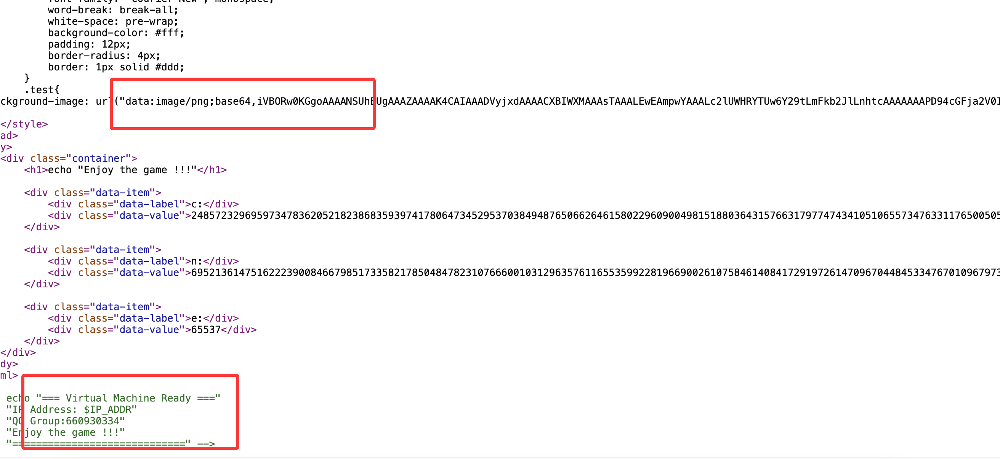
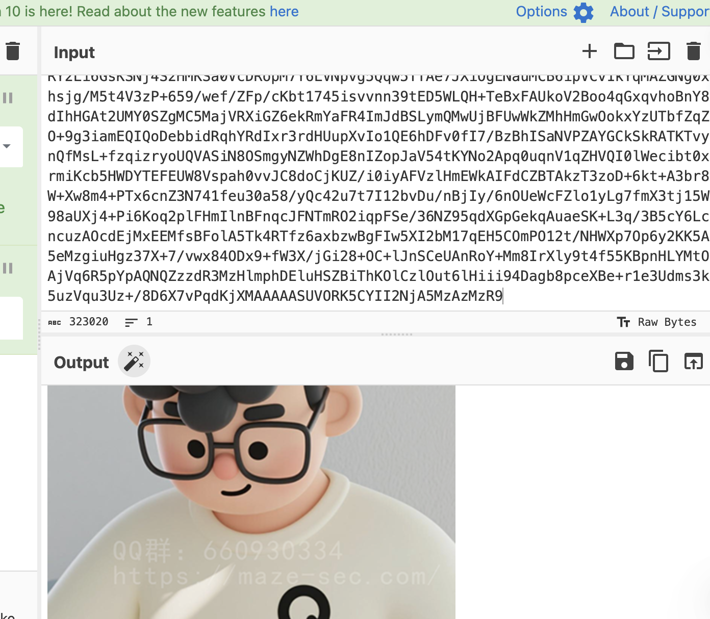
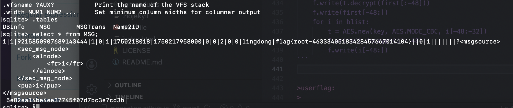

## 网段扫描
```
root@LingMj:~/xxoo# arp-scan -l
Interface: eth0, type: EN10MB, MAC: 00:0c:29:8a:67:91, IPv4: 192.168.137.194
Starting arp-scan 1.10.0 with 256 hosts (https://github.com/royhills/arp-scan)
192.168.137.1	3e:21:9c:12:bd:a3	(Unknown: locally administered)
192.168.137.52	a0:78:17:62:e5:0a	Apple, Inc.
192.168.137.104	3e:21:9c:12:bd:a3	(Unknown: locally administered)
```

## 端口扫描

```
root@LingMj:~/xxoo# nmap -p- -sCV 192.168.137.104       
Starting Nmap 7.95 ( https://nmap.org ) at 2025-11-30 04:02 EST
Nmap scan report for lingdong.mshome.net (192.168.137.104)
Host is up (0.012s latency).
Not shown: 65533 closed tcp ports (reset)
PORT   STATE SERVICE VERSION
22/tcp open  ssh     OpenSSH 10.0 (protocol 2.0)
80/tcp open  http    nginx
|_http-title: QQ Group:660930334
| http-robots.txt: 1 disallowed entry 
|_/0000000000000000000000000000000/1.txt
MAC Address: 3E:21:9C:12:BD:A3 (Unknown)

Service detection performed. Please report any incorrect results at https://nmap.org/submit/ .
Nmap done: 1 IP address (1 host up) scanned in 43.99 seconds
```

## 获取webshell

>80页面看起来是一个密码学的
>

  

  

```
root@LingMj:~/xxoo# python3 rsa_decrypt.py 
开始 Fermat 分解 n ...（可能需要一些时间，取决于 p,q 的接近程度）
找到因子：p = 833794707797802131749427474533851285168506931260624622649677278729595097385552136066205433738568617376547766764117013537419705792663474151700197357522609690110959943683328167871932720812937790702139291479651858573233204862863903968709873364261031952013602765660423473501833719205670739667617426774991711541325332460074189546760900904682240728190788607013927177921810740047095326122392805747153525379631662203613361831674719053248382864985420615513715592406035328088906335319436144138381184965635564199845034577917460282549310475172565217262598369939499268875626777413513938426932679021714542246743809029683342670096833432619514402267763610890150232993199917215696048666192006834705668266063870593891468063941484318957583100885274868813598007288348692728903233704034388800539075240272234972396097779228742327385395380182833119040109178258174914781318664111036132184760979971002021369704524809203075230974226033129315396033767474152293898206533544589281356248772141786985522648873242550669350096846752188685783408737862623844846640797151480997717201117355370327109536031334193445548799988726346318815881874576268164268577994050902444925043233820668857043905798324268404244448510404940155169472351169094090052690505214778194245718529351
q = 833794707797802131749427474533851285168506931260624622649677278729595097385552136066205433738568617376547766764117013537419705792663474151700197357522609690110959943683328167871932720812937790702139291479651858573233204862863903968709873364261031952013602765660423473501833719205670739667617426774991711541325332460074189546760900904682240728190788607013927177921810740047095326122392805747153525379631662203613361831674719053248382864985420615513715592406035328088906335319436144138381184965635564199845034577917460282549310475172565217262598369939499268875626777413513938426932679021714542246743809029683342670096833432619514402267763610890150232993199917215696048666192006834705668266063870593891468063941484318957583100885274868813598007288348692728903233704034388800539075240272234972396097779228742327385395380182833119040109178258174914781318664111036132184760979971002021369704524809203075230974226033129315396033767474152293898206533544589281356248772141786985522648873242550669350096846752188685783408737862623844846640797151480997717201117355370327109536031334193445548799988726346318815881874576268164268577994050902444925043233820668857043905798324268404244448510404940155169472351169094090052690505214778194245718540301
计算到私钥 d（十进制）：562847539330551053291274239933645442545323820230750515029482514219222244189106136810902165835055597481284583512196225693041514568617650673387366704411361012711086130932129463641382726779473553433223968951406145185043604687861237542865866229553567222902593398929312402116038696451991711138603916393466746697934578808063855524840235162413658243773284363284932439689185975277728200282823983341304410939041003741365525155272444625961445188235788217361126468167555467380749212125208889652894887725606903812487495201078168641225467867416596949410142372028479512999829343680487139095357116988191184635324478523888146078659842806858189770102375670811880635865406168269129776093128611049330218092702916320229581133098033388560877251521825104421495107332831478381274376216964415162462659256303293138765727348409336193599276960152368662489850851113072572260632233605907104659870769482930338637819824824187007351120457206673727141947270125119068143316622522489652014440159212672372093506114806487128868457328803437059914677974793910806827847645629079390718301524418602432959159314408470373497811756169990816369250846665736769388304761340024639946176181899480224184674357392418719733954856750678560372361112683458263670905768511672148515920111139637263369948534235120637703284953018169081912371691963691507771349334124596342365175611305146495021887555751894354554354948100978390502567649727660852834683251600406878763715561215199206280362632322070303402194655372874084846424331219357049609021703504636875476987071601917898208497549573949766097969893024177138958872047021791317502126217279325236543562705264262614554904760420555632480246594036604745955104132427795098570828732664119816554578697084248094202008839140069960566990788465796356738105280710211894511155389175139220772312707698754876613817616481775945480951390572378393148172684738171845336583963097617649295519526119870998821248814098941956218669899685887886876649792029060070543921029864815488902852187843890865191849788756354029185811779790012171576321819986477899819156555535242191806777375596132230161818500315569992373788394793951447567264028463125914427849383645509385174515043887032911030573019189376961421481652909100998890512488977823124485449110349959437606786340263390135305723793563262526864938388302815561863423861382450839374593087779299494192871185881462915380545282390371915153822249540455551603214239249311563849138653869433646275943090394267833458241809695914724379851162182391515728274196466204608473
得到明文整数 m = 516605280739385691424064
尝试按几种方式解读明文字节：
-> 原始 bytes (hex)： 6d653a776c63306d4540
-> 直接按 UTF-8 解码： me:wlc0mE@
```

>解密结果为一个像密码的东西
>

```
import math
from typing import Tuple, Optional

# ========== 在这里填入你的值 ==========
# 示例（小例子）：n = 0x95b9（可替换为题目给出的 n）
# 你可以直接写十进制大整数，例如:
# n = 179769313486231590770839156793787453197860296048756011706444423684197...
n = 695213614751622239008466798517335821785048478231076660010312963576116553599228196690026107584614084172919726147096704484533476701096797379931545104638371750128092345556813521903264286265220947838315823011521222356097979992618819141838336099177371135667224478140001637751914435804937536947373393178888222136537411020638928353935326557965734754182508854607222474978989073706185059310115821938579075740438573327764798094594511834969283878350682304626852095672686682103548146686703763756983212214197396391922067377693886772083783856214431374008038233582058874902840530292468490451995314198441087608987360278558914219211257619500276728984703713564112049467783487247289962792652891730714007107964172466101623828565291735353365356169280458894278536144137217035254693720786235633960596688221582058374441154803193918466533748044738593520370817946011744816997204881930189375863672884954590235526449037915224575856714298305208460427038620967759831669301914027861890920762063380562202305174354449706263821179400117880013348356246226512883330842111479221800360485607002537719226219649596164042407302514421457856190141878519961842502292616543749941622503875803076808665888170281114140941205956938894647909501534816039243109582746554921828301632594788593005492079661962852256973731066006874230999802859661674706932819749110056939663160374731059175412450992769838927822313613771964057309903725002259683027035092692463125127593228613008336542331444408200527065327343773582916599874605200712958756178336623102480033922098842494384697628271851559872429245264099564370714679733698540442524659783058258405823195672189179633937898292455767459209511509512071248786870646850883598878517584222977070851338232563793011063145353008093511065398526498464254132334590937188224856122503982889163333904708451199040305104617688092586599510015854139433048060344626317013808027799127455324887027887028330511480135170793482227672297800682135087662464733854162518265235097880134164970749081750040062511324508914820025577595089454793594275690308136008361580391278431023212583108651258126281252642934842653811831652243260710102917787907241914216641051653556481273397620923594466695457521811766321594861120838945948679248428147948534867695012621755871637025731957544930759719919650187615063483750572710597447446618277306938155824564466003798112292711205657707249612974841620780069742622815842647960073074280289297698085861596077355068154259160208786982495577909784018791236779135656604886366845036144874651
e = 65537
c = 248572329695973478362052182386835939741780647345295370384948765066264615802296090049815188036431576631797747434105106557347633117650050521321210045336899544725507571957071600903886005417706294793737099741836900763694331987804822291585926732616377830244486437626343746089375428287395387898863530608997490939119682989457995477459194959047912600531203350043180684424347179988873057991506761625275350195344920627652206158301633645063851914041020965562368988326399931096094011388686864692459371985391446095940209482208687107282464633340518342845766701410462637425834386891240008750978021095001641783628790655577247420899204493495661801447201570098971419001438320104157570697184724381833340867103604721026995721878502509503747881367989159120810433286101288981604811782615350141199334519304355716891332023582000785449132019056426669961375970093095683168744327933776121734310182480496674553633039532366325687060814567278922832199117170888096704981210784852454144575130727408756016971619430337221934573531774258498914514353136657609930217500896418121168596825189671922220835487138548368705525540076057152900780620277996198408050304658967201288421137190287628457401569072607796966676037243414037700424920214198274817913263498849377952487257878279213177839237426230644979889588133465775583793170683180967230118928529599812068268688988982811920910548518527710062483312775104203772108830571417599523697701063947365556218382653749574234399881673955190363360210323613035516865190523822394691864606158816704586470702082203754400209686965470237429765142158499926616499103381660308478217825671823202255873798734935199100715006045543961665975367359390941637181034654345714926761555214819025895212310772981499331595198872788941409926769504282914300207219186024671088307374922470092636499917530826402928536987948692942003856293175094046948837470268522594283604795224671336014632806845472573173572805831017936563252188781423271931103093393289127686958424777337123239798699646084536612394229763462231784908109831673315510423750402168554368053774903966763212119602726123947032016061853537287913331748697085083313364536666319813968726925248834907259170258856155106278486963117508289087927072558836141129618087268585996858998325603936821853866006160916937388256767627093516754446420453699750942883971126534576466109780026792248761535893943194878994008888653876230053001366283748235317831642618540448033910238898993655351411746805894404164037295813981845121460453541734483237977850685616648974
# ======================================

def int_sqrt(n: int) -> int:
    return math.isqrt(n)

def is_perfect_square(n: int) -> bool:
    r = int_sqrt(n)
    return r*r == n

def fermat_factor(n: int, max_iters: Optional[int]=None) -> Tuple[Optional[int], Optional[int]]:
    """
    Fermat factorization: find p,q such that n = p*q, assuming p and q are close.
    Returns (p,q) or (None,None) if not found within max_iters.
    """
    a = int_sqrt(n)
    if a*a < n:
        a += 1
    b2 = a*a - n
    iters = 0
    # Heuristic max iterations if not provided: try up to 10^7 or sqrt(2n)? keep safe
    if max_iters is None:
        max_iters = 10_000_000
    while iters < max_iters:
        if is_perfect_square(b2):
            b = int_sqrt(b2)
            p = a - b
            q = a + b
            if p > 1 and q > 1 and p*q == n:
                return (p, q)
            # else continue searching (rare)
        a += 1
        b2 = a*a - n
        iters += 1
    return (None, None)

def egcd(a:int,b:int):
    if b == 0: return (a,1,0)
    g,x1,y1 = egcd(b, a % b)
    x = y1
    y = x1 - (a // b) * y1
    return (g, x, y)

def modinv(a:int, m:int) -> Optional[int]:
    g,x,y = egcd(a,m)
    if g != 1:
        return None
    return x % m

def int_to_bytes(i: int) -> bytes:
    # minimal length
    length = (i.bit_length() + 7) // 8
    return i.to_bytes(length, byteorder='big')

def try_strip_pkcs1_v1_5(plain_bytes: bytes) -> bytes:
    # PKCS#1 v1.5: 0x00 || 0x02 || PS || 0x00 || M
    if len(plain_bytes) >= 11 and plain_bytes[0] == 0x00 and plain_bytes[1] == 0x02:
        # find 0x00 separator after padding
        try:
            sep_idx = plain_bytes.index(b'\x00', 2)
            return plain_bytes[sep_idx+1:]
        except ValueError:
            return plain_bytes
    return plain_bytes

def main():
    global n,e,c
    if n == 0 or c == 0:
        print("请在脚本顶部把 n 和 c（以及如果需要 e）替换为题目给的数值，然后重新运行。")
        return

    print("开始 Fermat 分解 n ...（可能需要一些时间，取决于 p,q 的接近程度）")
    p,q = fermat_factor(n)
    if p is None:
        print("费马分解失败（在设定迭代次数内未找到因子）。")
        print("提示：如果 p 和 q 差距较大，费马法效率低。可尝试 Pollard Rho、ECM 或调用专门的因式分解库。")
        return
    if p > q:
        p,q = q,p
    print(f"找到因子：p = {p}\nq = {q}")
    if p*q != n:
        print("警告：p*q != n（出错）")
        return

    phi = (p-1)*(q-1)
    d = modinv(e, phi)
    if d is None:
        print("无法计算 e 关于 phi 的模逆（gcd(e,phi) != 1）")
        return
    print(f"计算到私钥 d（十进制）：{d}")

    m = pow(c, d, n)
    print(f"得到明文整数 m = {m}")

    mb = int_to_bytes(m)
    print("尝试按几种方式解读明文字节：")
    print("-> 原始 bytes (hex)：", mb.hex())

    # 尝试去掉 PKCS#1 v1.5 填充
    stripped = try_strip_pkcs1_v1_5(mb)
    if stripped != mb:
        print("-> 可能存在 PKCS#1 v1.5 填充，去掉填充后的数据（hex）：", stripped.hex())
        try:
            print("-> 解码为 UTF-8（去填充后）：", stripped.decode('utf-8'))
        except Exception as ex:
            print("-> 无法按 UTF-8 解码（去填充后）:", ex)

    # 直接尝试 UTF-8 解码
    try:
        print("-> 直接按 UTF-8 解码：", mb.decode('utf-8'))
    except Exception as ex:
        print("-> 直接按 UTF-8 解码失败：", ex)
        try:
            print("-> 按 latin-1 解码：", mb.decode('latin-1'))
        except Exception as ex2:
            print("-> 按 latin-1 解码也失败：", ex2)

if __name__ == "__main__":
    main()
```

>这是对应的python脚本
>

  

>这里还有东西像凯撒
>

  

>拼起来是flag{welcome:wlc0mE@，很明显这样看缺一部分，爆破了目录没有特殊想要的看网站源码会有感觉
>

  

>这里有一个图片但是网站上并没有显示很突兀
>

  

>很明显是一个彩蛋也是题目一部分，保存下来
>

```
root@LingMj:~/xxoo# exiftool download.png 
ExifTool Version Number         : 13.25
File Name                       : download.png
Directory                       : .
File Size                       : 242 kB
File Modification Date/Time     : 2025:11:29 22:50:19-05:00
File Access Date/Time           : 2025:11:29 22:51:53-05:00
File Inode Change Date/Time     : 2025:11:29 22:51:35-05:00
File Permissions                : -rw-r--r--
File Type                       : PNG
File Type Extension             : png
MIME Type                       : image/png
Image Width                     : 400
Image Height                    : 696
Bit Depth                       : 8
Color Type                      : RGB
Compression                     : Deflate/Inflate
Filter                          : Adaptive
Interlace                       : Noninterlaced
Pixels Per Unit X               : 2835
Pixels Per Unit Y               : 2835
Pixel Units                     : meters
XMP Toolkit                     : Adobe XMP Core 9.0-c001 79.14ecb42, 2022/12/02-19:12:44
Creator Tool                    : Adobe Photoshop 24.2 (Windows)
Create Date                     : 2025:11:29 11:56:12+08:00
Modify Date                     : 2025:11:29 12:16:27+08:00
Metadata Date                   : 2025:11:29 12:16:27+08:00
Format                          : image/png
Color Mode                      : RGB
Instance ID                     : xmp.iid:e12669bb-45c7-8b41-bfc4-9443a2ff13b3
Document ID                     : adobe:docid:photoshop:81e0edff-5f89-164d-9e81-17ab73c49c07
Original Document ID            : xmp.did:eb4776ba-28cb-9d4f-8b17-31f3174b358b
History Action                  : created, saved, converted, derived, saved, saved, converted, derived, saved, saved
History Instance ID             : xmp.iid:eb4776ba-28cb-9d4f-8b17-31f3174b358b, xmp.iid:04cbcef7-bf99-cd43-a97e-aea8cd7ffe32, xmp.iid:b3f0c3f6-516c-334e-8820-3e17d732b51e, xmp.iid:1fa79ccd-f1ad-b44e-b4b2-3d228ea1e915, xmp.iid:8f497d8d-490c-4948-b5cc-d1b06ba5a61b, xmp.iid:e12669bb-45c7-8b41-bfc4-9443a2ff13b3
History When                    : 2025:11:29 11:56:12+08:00, 2025:11:29 11:59:21+08:00, 2025:11:29 11:59:21+08:00, 2025:11:29 12:02:59+08:00, 2025:11:29 12:02:59+08:00, 2025:11:29 12:16:27+08:00
History Software Agent          : Adobe Photoshop 24.2 (Windows), Adobe Photoshop 24.2 (Windows), Adobe Photoshop 24.2 (Windows), Adobe Photoshop 24.2 (Windows), Adobe Photoshop 24.2 (Windows), Adobe Photoshop 24.2 (Windows)
History Changed                 : /, /, /, /, /
History Parameters              : from image/png to image/tiff, converted from image/png to image/tiff, from image/tiff to image/png, converted from image/tiff to image/png
Derived From Instance ID        : xmp.iid:1fa79ccd-f1ad-b44e-b4b2-3d228ea1e915
Derived From Document ID        : xmp.did:b3f0c3f6-516c-334e-8820-3e17d732b51e
Derived From Original Document ID: xmp.did:eb4776ba-28cb-9d4f-8b17-31f3174b358b
Warning                         : [minor] Trailer data after PNG IEND chunk
Image Size                      : 400x696
Megapixels                      : 0.278
```

```
                                                                                                                                                                                                        
root@LingMj:~/xxoo# strings -n 10 download.png
siTXtXML:com.adobe.xmp
<?xpacket begin="
" id="W5M0MpCehiHzreSzNTczkc9d"?> <x:xmpmeta xmlns:x="adobe:ns:meta/" x:xmptk="Adobe XMP Core 9.0-c001 79.14ecb42, 2022/12/02-19:12:44        "> <rdf:RDF xmlns:rdf="http://www.w3.org/1999/02/22-rdf-syntax-ns#"> <rdf:Description rdf:about="" xmlns:xmp="http://ns.adobe.com/xap/1.0/" xmlns:dc="http://purl.org/dc/elements/1.1/" xmlns:photoshop="http://ns.adobe.com/photoshop/1.0/" xmlns:xmpMM="http://ns.adobe.com/xap/1.0/mm/" xmlns:stEvt="http://ns.adobe.com/xap/1.0/sType/ResourceEvent#" xmlns:stRef="http://ns.adobe.com/xap/1.0/sType/ResourceRef#" xmp:CreatorTool="Adobe Photoshop 24.2 (Windows)" xmp:CreateDate="2025-11-29T11:56:12+08:00" xmp:ModifyDate="2025-11-29T12:16:27+08:00" xmp:MetadataDate="2025-11-29T12:16:27+08:00" dc:format="image/png" photoshop:ColorMode="3" xmpMM:InstanceID="xmp.iid:e12669bb-45c7-8b41-bfc4-9443a2ff13b3" xmpMM:DocumentID="adobe:docid:photoshop:81e0edff-5f89-164d-9e81-17ab73c49c07" xmpMM:OriginalDocumentID="xmp.did:eb4776ba-28cb-9d4f-8b17-31f3174b358b"> <xmpMM:History> <rdf:Seq> <rdf:li stEvt:action="created" stEvt:instanceID="xmp.iid:eb4776ba-28cb-9d4f-8b17-31f3174b358b" stEvt:when="2025-11-29T11:56:12+08:00" stEvt:softwareAgent="Adobe Photoshop 24.2 (Windows)"/> <rdf:li stEvt:action="saved" stEvt:instanceID="xmp.iid:04cbcef7-bf99-cd43-a97e-aea8cd7ffe32" stEvt:when="2025-11-29T11:59:21+08:00" stEvt:softwareAgent="Adobe Photoshop 24.2 (Windows)" stEvt:changed="/"/> <rdf:li stEvt:action="converted" stEvt:parameters="from image/png to image/tiff"/> <rdf:li stEvt:action="derived" stEvt:parameters="converted from image/png to image/tiff"/> <rdf:li stEvt:action="saved" stEvt:instanceID="xmp.iid:b3f0c3f6-516c-334e-8820-3e17d732b51e" stEvt:when="2025-11-29T11:59:21+08:00" stEvt:softwareAgent="Adobe Photoshop 24.2 (Windows)" stEvt:changed="/"/> <rdf:li stEvt:action="saved" stEvt:instanceID="xmp.iid:1fa79ccd-f1ad-b44e-b4b2-3d228ea1e915" stEvt:when="2025-11-29T12:02:59+08:00" stEvt:softwareAgent="Adobe Photoshop 24.2 (Windows)" stEvt:changed="/"/> <rdf:li stEvt:action="converted" stEvt:parameters="from image/tiff to image/png"/> <rdf:li stEvt:action="derived" stEvt:parameters="converted from image/tiff to image/png"/> <rdf:li stEvt:action="saved" stEvt:instanceID="xmp.iid:8f497d8d-490c-4948-b5cc-d1b06ba5a61b" stEvt:when="2025-11-29T12:02:59+08:00" stEvt:softwareAgent="Adobe Photoshop 24.2 (Windows)" stEvt:changed="/"/> <rdf:li stEvt:action="saved" stEvt:instanceID="xmp.iid:e12669bb-45c7-8b41-bfc4-9443a2ff13b3" stEvt:when="2025-11-29T12:16:27+08:00" stEvt:softwareAgent="Adobe Photoshop 24.2 (Windows)" stEvt:changed="/"/> </rdf:Seq> </xmpMM:History> <xmpMM:DerivedFrom stRef:instanceID="xmp.iid:1fa79ccd-f1ad-b44e-b4b2-3d228ea1e915" stRef:documentID="xmp.did:b3f0c3f6-516c-334e-8820-3e17d732b51e" stRef:originalDocumentID="xmp.did:eb4776ba-28cb-9d4f-8b17-31f3174b358b"/> </rdf:Description> </rdf:RDF> </x:xmpmeta> <?xpacket end="r"?>
DEm58'D~R:
ff2FKZ=Qn[
^s	Kc@$RO]
l+&\i`JUFc'1
OvvwvvvwwF
&TB PBb&f4
A8Q9`$@AL(
aTv>(PbU$G
zXmT;,\OXh
	Q=((8"K=0w
eQTU5otcZK
]t ")JSug'
&]\][X=1a1
[#;b"q5bGF
RR?<i8;,g)
1v:I%CFRfSqE
660930334}
                                                                                                                                                                                                        
root@LingMj:~/xxoo# 
```

>有后面部分了 flag{welcome:wlc0mE@660930334} 应该是这样
>


## 提权

>可以登陆
>

```
root@LingMj:~/xxoo# ssh welcome@192.168.137.104
The authenticity of host '192.168.137.104 (192.168.137.104)' can't be established.
ED25519 key fingerprint is SHA256:xJ90oWmr5sPR2afHz9etzSdtxINmLI+JvbwgV/iCsWY.
This host key is known by the following other names/addresses:
    ~/.ssh/known_hosts:1: [hashed name]
Are you sure you want to continue connecting (yes/no/[fingerprint])? yes
Warning: Permanently added '192.168.137.104' (ED25519) to the list of known hosts.
welcome@192.168.137.104's password: 
=============================
Welcome!!!
QQ Group:660930334
=============================
lingdong:~$ id
uid=1000(welcome) gid=1000(welcome) groups=1000(welcome)
lingdong:~$ cat user.txt 
flag{user-415621D5297F8F4BE138A5BB03}lingdong:~$ 
lingdong:~$ ls -al
total 24
drwxr-sr-x    4 welcome  welcome       4096 Nov 30 12:03 .
drwxr-xr-x    3 root     root          4096 Jun  3 08:22 ..
lrwxrwxrwx    1 root     welcome          9 Jun  3 09:07 .ash_history -> /dev/null
drwx--S---    2 welcome  welcome       4096 Nov 30 12:03 .ssh
-rw-r--r--    1 root     welcome          6 Nov 29 14:22 tip.txt
-rw-r--r--    1 root     welcome         37 Nov 29 14:22 user.txt
drwxr-sr-x    5 root     welcome       4096 Nov 29 14:22 wechat_files
```

>根据题目名字跟微信有关
>


```
lingdong:~$ ls -al
total 24
drwxr-sr-x    4 welcome  welcome       4096 Nov 30 12:03 .
drwxr-xr-x    3 root     root          4096 Jun  3 08:22 ..
lrwxrwxrwx    1 root     welcome          9 Jun  3 09:07 .ash_history -> /dev/null
drwx--S---    2 welcome  welcome       4096 Nov 30 12:03 .ssh
-rw-r--r--    1 root     welcome          6 Nov 29 14:22 tip.txt
-rw-r--r--    1 root     welcome         37 Nov 29 14:22 user.txt
drwxr-sr-x    5 root     welcome       4096 Nov 29 14:22 wechat_files
lingdong:~$ cd wechat_files/
lingdong:~/wechat_files$ ls -al
total 20
drwxr-sr-x    5 root     welcome       4096 Nov 29 14:22 .
drwxr-sr-x    4 welcome  welcome       4096 Nov 30 12:03 ..
drwxr-sr-x    2 root     welcome       4096 Nov 29 14:22 Backup
drwxr-sr-x    2 root     welcome       4096 Nov 29 14:22 all_users
drwxr-sr-x    6 root     welcome       4096 Nov 29 14:22 lingdong
lingdong:~/wechat_files$ cd lingdong/
lingdong:~/wechat_files/lingdong$ ls -al
total 24
drwxr-sr-x    6 root     welcome       4096 Nov 29 14:22 .
drwxr-sr-x    5 root     welcome       4096 Nov 29 14:22 ..
drwxr-sr-x    2 root     welcome       4096 Nov 29 14:22 cache
drwxr-sr-x    2 root     welcome       4096 Nov 29 14:22 config
drwxr-sr-x    2 root     welcome       4096 Nov 29 14:22 msg
drwxr-sr-x    2 root     welcome       4096 Nov 29 14:22 temp
lingdong:~/wechat_files/lingdong$ cd msg/
lingdong:~/wechat_files/lingdong/msg$ ls a-l
ls: a-l: No such file or directory
lingdong:~/wechat_files/lingdong/msg$ ls -al
total 51216
drwxr-sr-x    2 root     welcome       4096 Nov 29 14:22 .
drwxr-sr-x    6 root     welcome       4096 Nov 29 14:22 ..
-rw-r--r--    1 root     welcome   52428800 Nov 29 14:22 MSG0.db
-rw-r--r--    1 root     welcome         64 Nov 29 14:22 key.txt
-rw-r--r--    1 root     welcome         32 Nov 29 14:22 salt.txt
lingdong:~/wechat_files/lingdong/msg$ 
```

>全部提取出来
>

```
root@LingMj:~/xxoo/msg# ls -al 
total 24
drwxr-xr-x 2 root root 4096 Nov 29 23:25 .
drwxr-xr-x 4 root root 4096 Nov 29 23:06 ..
-rw-r--r-- 1 root root 1551 Nov 29 23:17 decrypt_msgdb.py
-rw-r--r-- 1 root root   64 Nov 29 23:03 key.txt
-rw-r--r-- 1 root root   32 Nov 29 23:03 salt.txt
-rw-r--r-- 1 root root 1421 Nov 29 23:21 weixin_decrypt.py
                                                                                                                                                                                                        
root@LingMj:~/xxoo/msg# 
```

>然后网上找了个脚本利用
>

```
root@LingMj:~/xxoo/msg# cat weixin_decrypt.py 
from Crypto.Cipher import AES
import hashlib, hmac, ctypes, sys, getopt
 
input_pass = 'c22ce55044354439b22d75a1e1e4be286bc480cde0f34583bb490fe686b56061'
input_dir = r'/root/xxoo/msg/MSG0.db'
 
SQLITE_FILE_HEADER = bytes('SQLite format 3', encoding='ASCII') + bytes(1)
IV_SIZE = 16
HMAC_SHA1_SIZE = 20
KEY_SIZE = 32
DEFAULT_PAGESIZE = 4096
DEFAULT_ITER = 64000
opts, args = getopt.getopt(sys.argv[1:], 'hk:d:')
 
 
 
password = bytes.fromhex(input_pass.replace(' ', ''))
 
with open(input_dir, 'rb') as (f):
    blist = f.read()
print(len(blist))
salt = blist[:16]
key = hashlib.pbkdf2_hmac('sha1', password, salt, DEFAULT_ITER, KEY_SIZE)
first = blist[16:DEFAULT_PAGESIZE]
mac_salt = bytes([x ^ 58 for x in salt])
mac_key = hashlib.pbkdf2_hmac('sha1', key, mac_salt, 2, KEY_SIZE)
hash_mac = hmac.new(mac_key, digestmod='sha1')
hash_mac.update(first[:-32])
hash_mac.update(bytes(ctypes.c_int(1)))
 
if hash_mac.digest() == first[-32:-12]:
    print('Decryption Success')
else:
    print('Password Error')
blist = [blist[i:i + DEFAULT_PAGESIZE] for i in range(DEFAULT_PAGESIZE, len(blist), DEFAULT_PAGESIZE)]
 
with open(input_dir, 'wb') as (f):
    f.write(SQLITE_FILE_HEADER)
    t = AES.new(key, AES.MODE_CBC, first[-48:-32])
    f.write(t.decrypt(first[:-48]))
    f.write(first[-48:])
    for i in blist:
        t = AES.new(key, AES.MODE_CBC, i[-48:-32])
        f.write(t.decrypt(i[:-48]))
        f.write(i[-48:])
```

  

>这样就能看到root flag，因为没有给出密码和提权操作路线就到这结束了，主要懒得找非预期了
>


>userflag:
>
>rootflag:
>